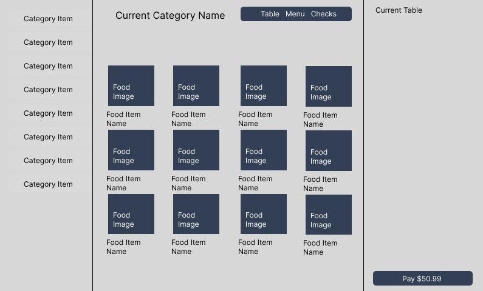
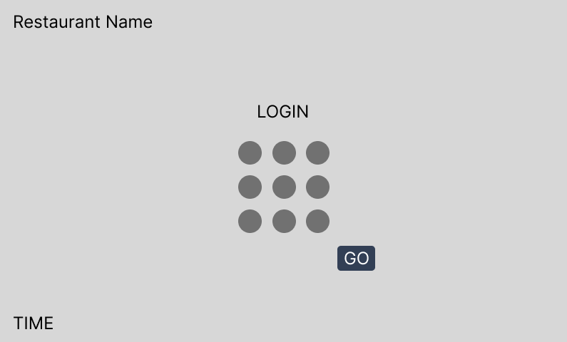

# Point of Sale

DESIGNED FOR TABLET

A responsive React Native point-of-sale app built with Expo SDK 57 and Expo Router. Staff can choose a profile, enter a PIN, search and filter the menu, build an order, adjust quantities, and complete payment with immediate on-screen feedback.


## Extra Expo packages

- [`expo-symbols`](https://docs.expo.dev/versions/v57.0.0/sdk/symbols/) — cross-platform SF Symbols and Material Symbols.
- [`expo-status-bar`](https://docs.expo.dev/versions/v57.0.0/sdk/status-bar/) — native status bar styling.
- [`expo-print`](https://docs.expo.dev/versions/v57.0.0/sdk/print/) — generates an itemized receipt and opens the native Android or iOS print dialog during checkout.

Expo Router is also provided by `expo-router` for file-based navigation and route parameters.

## Screenshots

### Register and order



### Staff sign-in



## Run locally

```bash
npm install
npm start
```

This starts the Expo development server in localhost mode for an emulator, simulator, or web browser running on the same computer.

### Physical device

To run the app in Expo Go on a separate phone or tablet, use tunnel mode:

```bash
npm install
npm run start:tunnel
```

Keep the terminal running and scan the displayed QR code using Expo Go. Tunnel mode is recommended because school, public, or guest Wi-Fi may prevent devices from communicating directly. On a physical iPhone, sign in to the same Expo account in Expo Go and Expo CLI if prompted.
